#  Production-Grade 3-Tier AWS Architecture using Terraform

## Project Overview
This project demonstrates a production-style 3-tier architecture deployed on AWS using Terraform Infrastructure as Code (IaC). It implements a highly available, scalable, and secure cloud environment with private application and database tiers.

The architecture follows cloud best practices including network isolation, auto scaling, HTTPS security, and infrastructure automation.

## ----------- Architecture ---------------

### Architecture Components
- Custom VPC across 2 Availability Zones
- Public and Private Subnets
- Internet Gateway and NAT Gateway
- Application Load Balancer (HTTPS)
- Auto Scaling Group (private EC2 instances)
- Amazon RDS (private database tier)
- Route53 DNS
- ACM TLS Certificate
- AWS Systems Manager Session Manager access
- Terraform Infrastructure as Code


## ----------- Key Features ---------------

### Networking
- Custom VPC design
- Public and private subnet architecture
- Multi-AZ deployment
- NAT Gateway for private internet access

### Security
- No public EC2 access
- SSM Session Manager (no bastion host)
- Secure database in private subnet
- HTTPS with ACM certificate

### Scalability
- Auto Scaling Group with target tracking policy
- Load balancing using ALB
- Health checks and failover

### Data Layer
- Amazon RDS MySQL instance
- Secure database connectivity from private instances
- Dynamic password generation (optional implementation)

### DNS & TLS
- Route53 hosted zone
- ACM certificate validation
- HTTP to HTTPS redirection

### Infrastructure as Code
- Fully automated using Terraform


## Tech Stack

- AWS (EC2, VPC, ALB, ASG, RDS, Route53, ACM, SSM)
- Terraform
- Linux (Ubuntu)
- MySQL
- DNS & TLS configuration


## Project folder structure

three-tier-aws-infra/
│
├── README.md
├── .gitignore
│
├── provider.tf
├── variables.tf
├── outputs.tf
├── terraform.tfvars.example
│
├── networking.tf        # VPC, subnets, IGW, NAT, route tables
├── security.tf          # Security groups
├── iam.tf               # IAM roles, policies, instance profile
├── alb.tf               # ALB + listeners
├── asg.tf               # Launch template + Auto Scaling
├── rds.tf               # Database tier
├── route53.tf           # DNS records
├── acm.tf               # TLS certificate
│
├── userdata.sh          # EC2 bootstrap script


###  Step-by-Step Deployment Guide

#### Prerequisites

Install:

- Terraform and AWS CLI v2 configured

```
chmod +x install-terraform-awscliv2.sh
./install-terraform-awscliv2.sh
```

- Domain name (optional)

Verify:

```
terraform -v
aws --version
aws configure
```
*Required: Access key and ID*


### Deployment Flow (How Terraform Creates Resources)

Terraform creates infrastructure in this logical order automatically:

- IAM roles and instance profile
- VPC and networking
- security groups
- load balancer and listeners
- launch template and Auto Scaling Group
- database tier
- DNS and TLS configuration


Step 1: Clone Repository

```
git clone <repo-url>
cd three-tier-aws-infra
```

Step 2: Configure Variables

Create:

```
terraform.tfvars
```
Example:

```
project_name = "three-tier-demo"
region       = "us-east-2"
```
For db_password = "securepassword@1234!"   
(Using hardcoded secrets are not recommended, we can use ssm parameter store or secret manager)

Step 3: Initialize Terraform

```
terraform init
```
Downloads providers and initializes state.

Step 4: Review Execution Plan

```
terraform plan
```
Shows all resources to be created.

Step 5: Deploy Infrastructure

```
terraform apply
```

Test your domain:

```
https://your-domain.com
```


### Step 1 — Create IAM Role for EC2 (Security First)

IAM must exist before launching instances.

Create iam.tf

Implement:

- EC2 IAM role

- trust policy for EC2 service

- attach AmazonSSMManagedInstanceCore policy

- create instance profile

Purpose:

- secure instance access using SSM

- no SSH keys required

- no bastion host needed

Verify

After apply:

- role exists

- instance profile exists

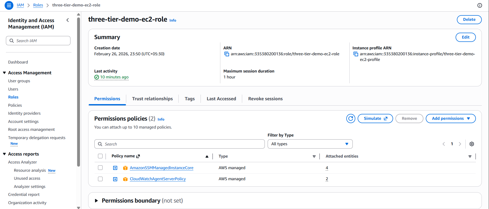

### Step 2 — Create Networking Layer (VPC Foundation)

Everything runs inside the network.

Create networking.tf

Create:

- VPC

- public subnets (2 AZ)

- private subnets (2 AZ)

- Internet Gateway

- NAT Gateway

- route tables

- route table associations

Architecture goal:

- ALB in public subnet

- EC2 and RDS in private subnet

Verify

Check:

- VPC created

- subnets in multiple AZs

- NAT routing configured

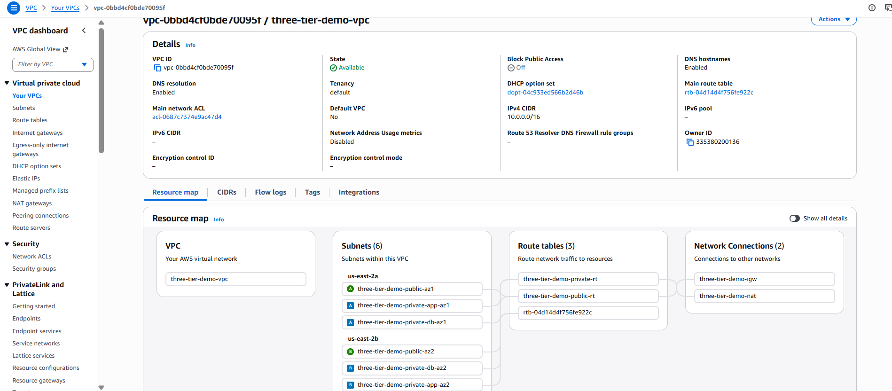

### Step 3 — Create Security Groups

Security rules define communication between tiers.

Create security.tf

Create:

1. ALB security group

- allow HTTP/HTTPS from internet

2. EC2 security group

- allow traffic from ALB only

3. RDS security group

- allow MySQL from EC2 only

Architecture goal:

Internet -> ALB -> EC2 -> RDS

No direct access to EC2 or RDS.

### Step 4 — Create Application Load Balancer

This is the public entry point.

Create alb.tf

Create:

- Application Load Balancer in public subnet

- target group

- health checks

- HTTP listener (port 80)

Purpose:

- distribute traffic

- enable high availability

- route to Auto Scaling instances

Verify

- ALB created

- DNS endpoint available

- target group exists

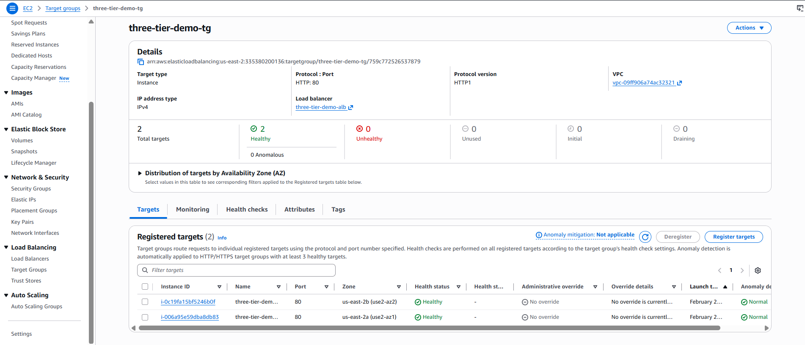

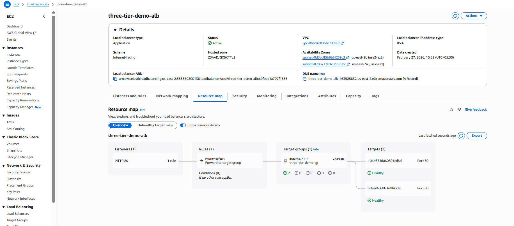


### Step 5 — Create Launch Template

Defines EC2 configuration.

Create userdata.sh

Install:

- Apache or application

- metadata retrieval

- simple test page

Update asg.tf

Create:

- launch template

- instance profile attachment

- security group reference

- user data script

Purpose:

- standardize instance configuration

- automate application setup

### Step 6 — Create Auto Scaling Group (Application Tier)

Creates scalable application layer.

Continue in asg.tf

Create:

Auto Scaling Group

- private subnet placement

- target group attachment

- health checks

Architecture goal:

- private compute layer

- scalable application tier

Verify

- instances running

- instances in private subnet

- registered in target group

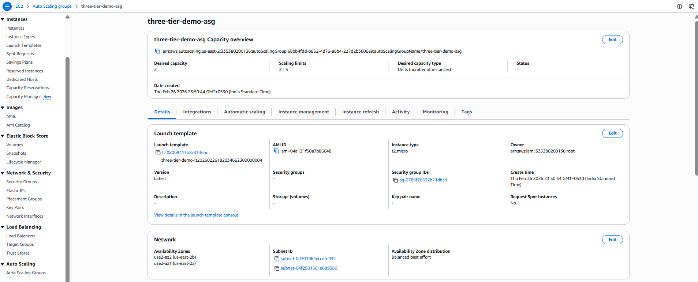

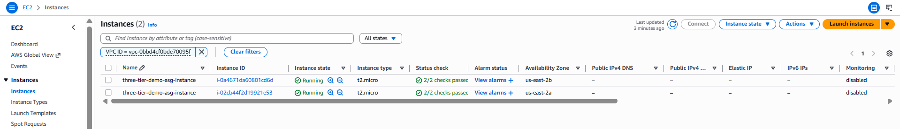

### Step 7 — Access Private Instances Using SSM

Verify secure access.

Steps:

- open AWS Systems Manager

- start session to instance

This confirms:

- IAM configured correctly

- no public SSH needed

- private networking works

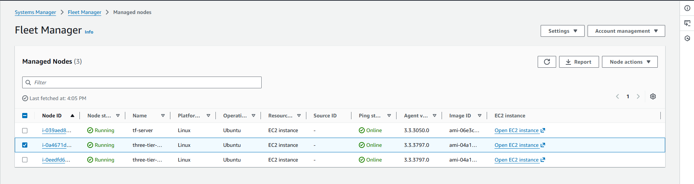

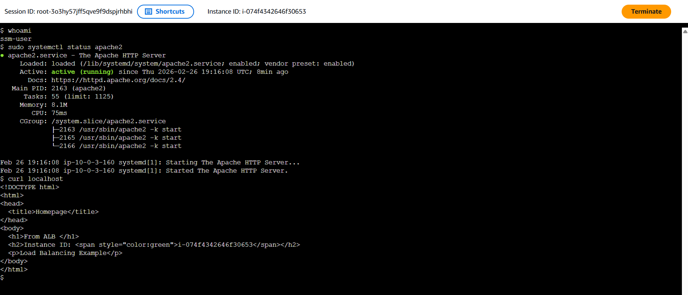


### Step 8 — Test Load Balancer Routing

- open ALB DNS endpoint

- confirm application response

- verify health checks

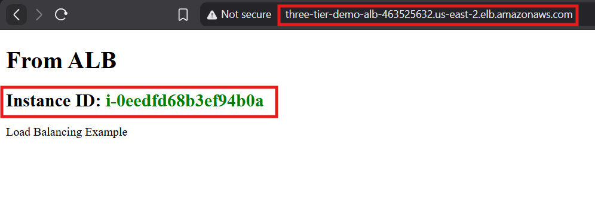

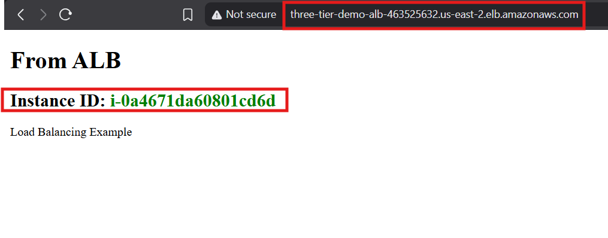

### Step 9 — Create Database Tier

Create private database layer.

Create rds.tf

Create:

- DB subnet group

- RDS instance

- private subnet placement

- security group attachment

Purpose:

- isolated database tier

- secure connectivity from application layer

Verify

- RDS available

- connect from EC2

- database accessible

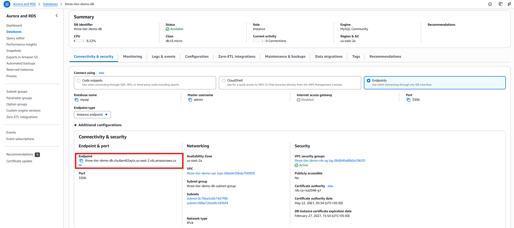

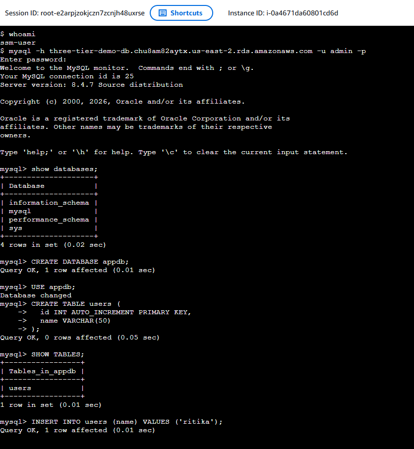


### Step 10 — Implement Auto Scaling Policy

Enable dynamic scaling.

Update asg.tf

Create:

- target tracking policy

- CPU based scaling

Verify

Generate load:

```
stress --cpu 2 --timeout 300
```

Observe:

- scale out

- scale in

- To increase load on ASG, we install stress on one of the instance and run command :
This will result in automatic provisioning of EC2 instance.

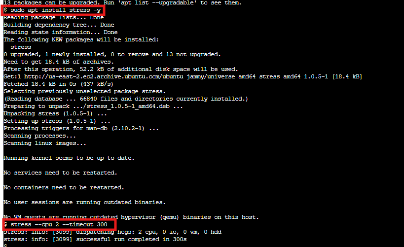

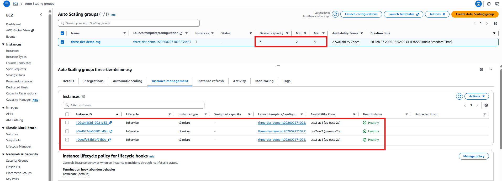

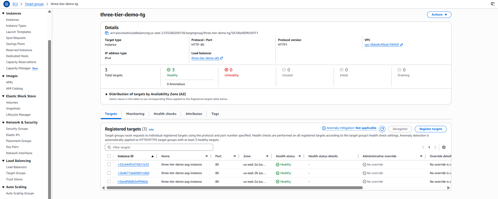

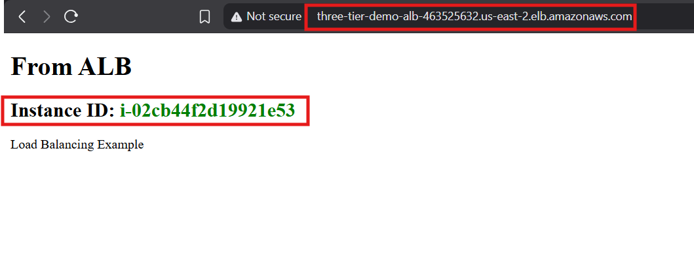

### Step 11 — Configure Domain and DNS

Enable custom domain access.

Create route53.tf

Create:

- hosted zone

- alias record to ALB

If using external registrar(I use Hostinger for my custom domain):

- update nameservers

Verify

- Domain resolves to ALB.

### Step 12 — Enable HTTPS with ACM

Secure application.

Create acm.tf

Create:

- ACM certificate

- DNS validation

- Update ALB listener - Add HTTPS listener (443)

- HTTP to HTTPS redirect

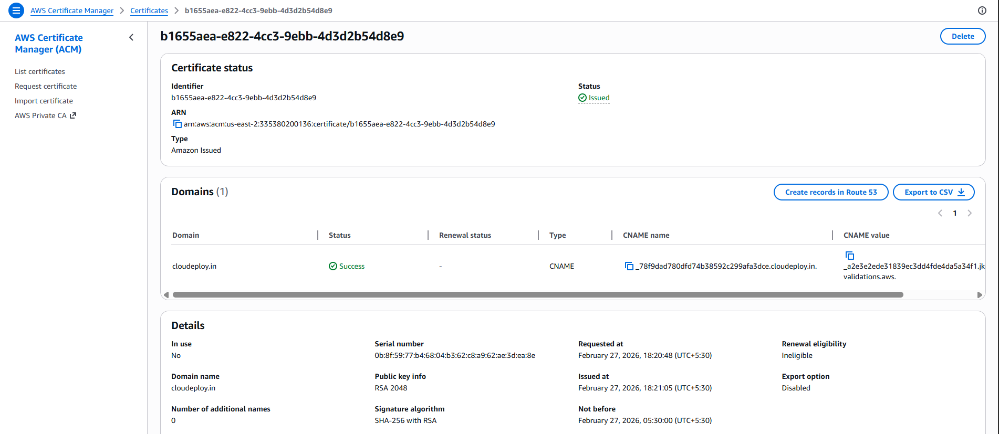

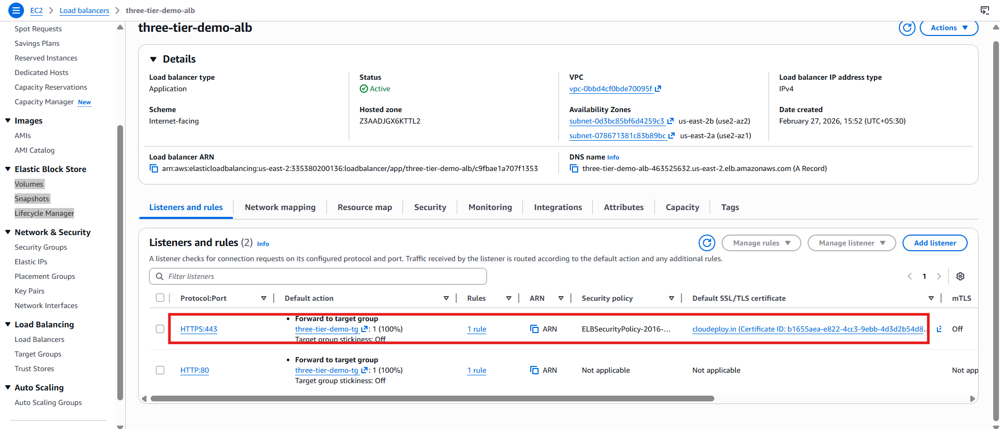

Verify

- certificate issued

- HTTPS endpoint working

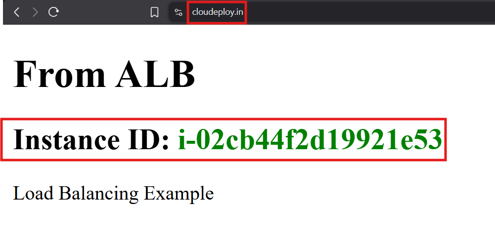

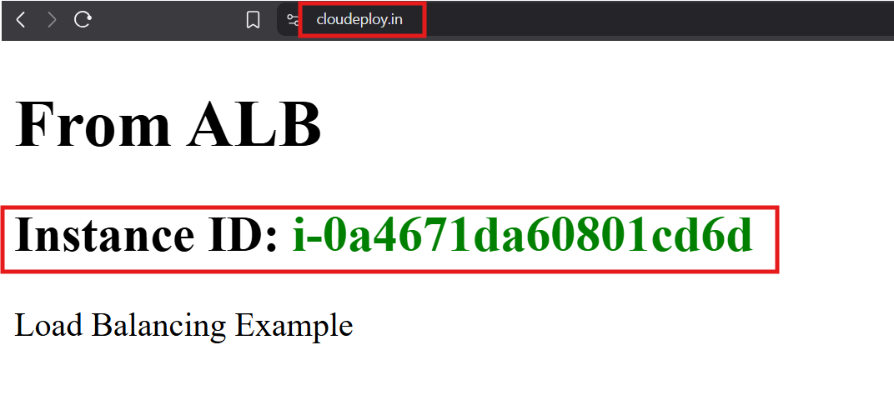

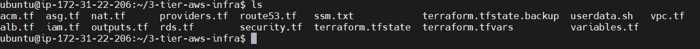

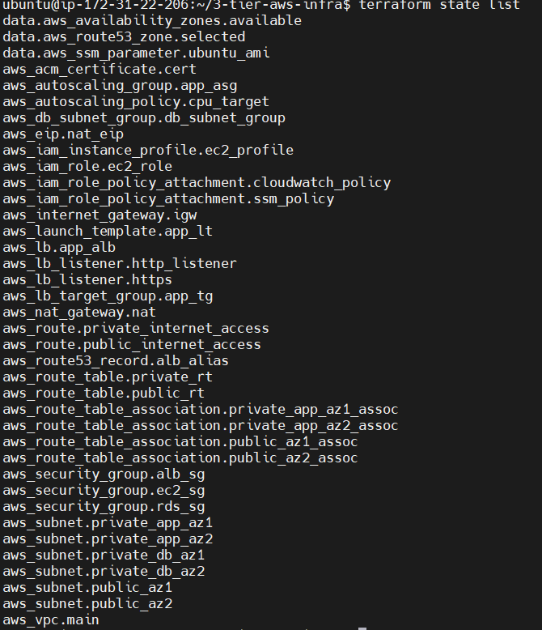 


#### Step 13 — Optional Enhancements

- random password generation for RDS

- DB read replica/Multi-az DB configuration

- monitoring

- WAF integration